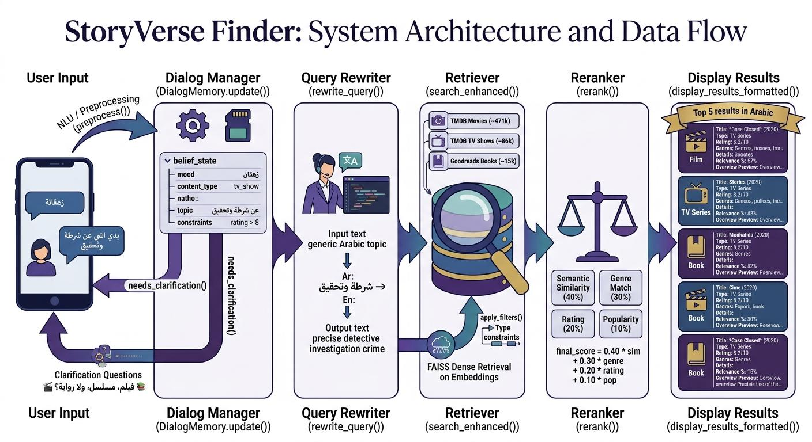

# StoryVerse Finder 🎬📚📺

**A Conversational Information Retrieval (CIR) system for personalized, Arabic-language entertainment discovery — across movies, TV shows, and books.**

> Built as a graduate-level CIR project at UCAS, supervised by Dr. Esraa Farwana.

---

## 🧠 The Problem

Traditional search engines don't handle natural, conversational, or mood-based requests well:

- **Keyword rigidity** — struggles with vague queries like *"something deep and mysterious for a rainy night"*
- **No memory** — every query is treated in isolation, forcing users to repeat filters like *"after 2015"* or *"high rating"*
- **Weak Arabic support** — most semantic search systems are built and tuned for English
- **Information overload** — no help narrowing hundreds of results down to a real decision

**StoryVerseFinder** solves this by acting as a conversational assistant: it understands Arabic natural-language input, tracks what the user wants across turns, asks clarifying questions when needed, and continuously refines its recommendations — without making the user start over.

---

## ✨ Key Features

- 🗣️ **Conversational, multi-turn search** — refine results turn-by-turn instead of re-searching from scratch
- 🌍 **Arabic-first** — understands colloquial Arabic queries via a dedicated query-rewriting step
- 🎯 **Unified content search** — movies, TV shows, and books in a single 572K-record index
- 🧭 **Belief-state tracking** — remembers mood, content type, and constraints (year, rating, etc.) across the conversation
- ❓ **Clarification engine** — proactively asks when the request is ambiguous (e.g., movie, series, or book?)
- 📊 **Multi-factor reranking** — balances semantic similarity, genre match, rating, and popularity

---

## 🏗️ System Architecture



```
User Input → NLU/Preprocessing → Dialog Manager (Belief State) → Clarification Engine
    → Query Rewriter (AR → EN) → FAISS Dense Retriever → Reranker → Results (in Arabic)
```

| Stage | What it does |
|---|---|
| **NLU / Preprocessing** | Extracts intent, mood, content type, and negative preferences from user input |
| **Dialog Manager** | Maintains conversation state via `DialogMemory` (mood, content type, constraints) |
| **Clarification Engine** | Asks a follow-up question when key information is missing |
| **Query Rewriter** | Converts Arabic conversational input into a descriptive English search query |
| **Dense Retriever (FAISS)** | Embeds the query and retrieves the top 200 semantically similar items from 572K+ records |
| **Reranker** | Re-scores candidates using: `Final Score = 0.40·Similarity + 0.30·Genre Match + 0.20·Rating + 0.10·Popularity` |

---

## 📚 Data

| Source | Records | Fields |
|---|---|---|
| TMDB Movies | ~471,373 | Title, Overview, Rating, Genres, Year, Runtime |
| TMDB TV Shows | ~85,755 | Title, Overview, Rating, Genres, Seasons |
| Goodreads Books | ~14,921 | Title, Overview, Rating, Genres, Authors, Pages |
| **Total** | **~572,000** | Unified, cleaned, and deduplicated |

**Preprocessing:** genre standardization (top-4 genres kept per item), removal of records with short/missing descriptions, and generation of 384-dimensional multilingual embeddings using `paraphrase-multilingual-MiniLM-L12-v2` — enabling Arabic queries to match English item descriptions.

### 📦 Dataset & Embeddings

Due to file size, the unified dataset and precomputed embeddings are **not stored in this repository**. They are provided as external Google Drive links instead:

- 📊 **Dataset (link):** [https://drive.google.com/file/d/1G5IoNINVZN-YgWOPzT_wzZis5R7dKBQk/view?usp=drive_link](https://drive.google.com/file/d/1G5IoNINVZN-YgWOPzT_wzZis5R7dKBQk/view?usp=drive_link)
- 🧠 **Embeddings (link):** [https://drive.google.com/file/d/1wbszyyArl-4uanOcZsyt_MMM3D4QYC8h/view?usp=sharing](https://drive.google.com/file/d/1wbszyyArl-4uanOcZsyt_MMM3D4QYC8h/view?usp=sharing)

---

## ⚙️ Setup Instructions

The notebook (`notebook/StoryVerseFinder.ipynb`) expects the dataset and embeddings to be available in **your own** Google Drive.

**Before running:**
1. Download the dataset and embeddings from the links above and upload them to your own Google Drive.
2. Place them so the path matches the one used in the notebook, or edit the file paths in the relevant cell to match wherever you saved them.
3. Run the cells in order — the first cell will prompt you to authorize Google Drive access.

---

## 💬 Example Conversation

```
User:   بدي شي عن شرطة وتحقيق          ("I want something about police and investigation")
System: تحب فيلم، مسلسل، ولا رواية؟     ("Do you prefer a movie, series, or novel?")
User:   مسلسل                          ("A series")
System: [Top 5 crime/investigation TV series]
User:   بدي تقييم فوق 8                ("I want a rating above 8")
System: [Refines results — no restart needed]
```

---

## 🛠️ Tech Stack

- **Retrieval:** FAISS (`IndexFlatL2`) over dense embeddings
- **Embeddings:** `paraphrase-multilingual-MiniLM-L12-v2` (384-dim, multilingual)
- **Constraint extraction:** Regex-based parsing of years, ratings, and other filters from natural language
- **Dialogue state:** Custom `DialogMemory` class for belief-state tracking

---

## 👥 Team

- Sojoud Baraka
- Faten Safi
- Fatma Abdelall
- Haya Al-Hindi

Supervised by **Dr. Esraa Farwana** — UCAS, CIR Course.

---

## 📖 References

1. A. M. Rahmani et al., *A Semantic Book Recommendation System Using Transformer-Based Embeddings and Vector Search*, 2025. [Link](https://www.researchgate.net/publication/393280356_A_Semantic_Book_Recommendation_System_Using_Transformer-_Based_Embeddings_and_Vector_Search)
2. R. J. Williams et al., *IAI MovieBot: A Conversational Movie Recommendation System*, 2020. [Link](https://arxiv.org/pdf/2009.03668)
3. Y. Zhang et al., *Towards Knowledgeable Conversational Agents for Recommendation*, EMNLP 2020. [Link](https://aclanthology.org/2020.emnlp-main.654/)
4. G. Christakopoulou et al., *Conversational Recommender Systems: A Survey*, 2021. [Link](https://www.sciencedirect.com/science/article/pii/S2666651021000164)

---

## 📄 License

This project was developed for academic purposes as part of the CIR course at UCAS.
